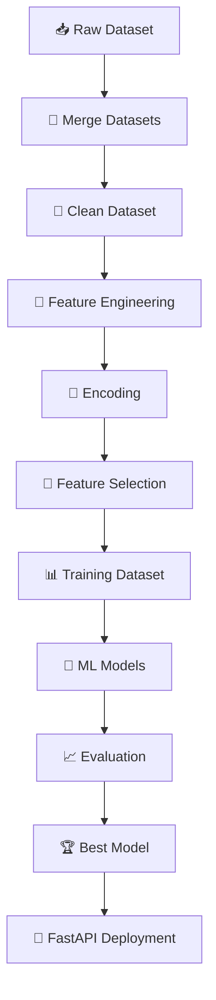

<div align="center">

# 🚀 PricePredictor AI
### Intelligent Product Price Prediction System

*An end-to-end Machine Learning pipeline that predicts e-commerce product prices — from raw data to a live API.*


</div>

---

## 📖 Table of Contents

- [Overview](#-project-overview)
- [Objectives](#-objectives)
- [Dataset](#-dataset)
- [Tech Stack](#️-tech-stack)
- [Project Structure](#-project-structure)
- [Workflow](#️-project-workflow)
- [Data Preprocessing](#-data-preprocessing)
- [Machine Learning Models](#-machine-learning-models)
- [Evaluation Metrics](#-evaluation-metrics)
- [Visualizations](#-visualizations)
- [Getting Started](#-getting-started)
- [Outputs](#-outputs)
- [Future Improvements](#-future-improvements)
- [Author](#-author)
- [Acknowledgements](#-acknowledgements)
- [License](#-license)

---

## 📌 Project Overview

**PricePredictor AI** is an end-to-end Machine Learning application developed for the **Infosys Springboard Internship**.

The project predicts the selling price of an e-commerce product using product specifications, shipping details, and purchase information. It covers the full ML lifecycle — preprocessing, feature engineering, model training, evaluation, visualization, and API deployment via **FastAPI**.

---

## 🎯 Objectives

| Goal | Description |
|------|-------------|
| 🎯 Predict prices | Use ML to estimate product selling price |
| ⚖️ Compare algorithms | Benchmark multiple regression models |
| 🔁 Reusable pipeline | Build modular, reusable preprocessing & training code |
| 🌐 Deploy | Serve the best model via a FastAPI endpoint |
| 📊 Evaluate | Analyze performance using multiple metrics |

---

## 📂 Dataset

**Brazilian E-Commerce Public Dataset by Olist**

| File | Purpose |
|------|---------|
| `olist_orders_dataset.csv` | Order-level metadata (timestamps, status) |
| `olist_order_items_dataset.csv` | Item-level pricing & shipping details |
| `olist_products_dataset.csv` | Product specifications |

📎 **Source:** [Kaggle – Brazilian E-Commerce Dataset](https://www.kaggle.com/datasets/olistbr/brazilian-ecommerce)

---

## 🛠️ Tech Stack

**Language**
- Python 3.13

**Core Libraries**

| Category | Tools |
|----------|-------|
| Data Handling | Pandas, NumPy |
| Modeling | Scikit-Learn, XGBoost |
| Serialization | Joblib |
| Visualization | Matplotlib |
| API / Serving | FastAPI, Uvicorn |

---

## 📁 Project Structure

```
INFOSYS_INTERNPROJECT/
│
├── api/
│   ├── app.py
│   ├── model_loader.py
│   ├── predict.py
│   └── schemas.py
│
├── dataset/
│   ├── raw/
│   ├── processed/
│   └── final/
│
├── preprocessing/
│   ├── merge_data.py
│   ├── clean_data.py
│   ├── feature_engineering.py
│   ├── encoding.py
│   └── feature_selection.py
│
├── models/
│   ├── linear_regression.py
│   ├── decision_tree.py
│   ├── random_forest.py
│   ├── gradient_boosting.py
│   └── xgboost_model.py
│
├── reports/
│   ├── graphs/
│   ├── metrics.txt
│   └── model_results.csv
│
├── saved_models/
├── utils/
├── requirements.txt
└── README.md
```

---

## ⚙️ Project Workflow



---

## 🔍 Data Preprocessing

### 🔗 Data Merging
Merged the three Olist datasets using `order_id` and `product_id`.

### 🧹 Data Cleaning
- Removed duplicate records
- Handled missing values
- Removed unnecessary columns
- Converted timestamps
- Standardized dataset

### 🧩 Feature Engineering
New features created:

`Purchase Year` · `Purchase Month` · `Purchase Day` · `Purchase Hour` · `Purchase Weekday` · `Purchase Quarter` · `Weekend Indicator` · `Delivery Days` · `Estimated Delivery Days` · `Delivery Difference` · `Product Volume` · `Product Density`

### 🔢 Encoding
Converted categorical features into numerical values suitable for Machine Learning.

### 🎯 Feature Selection
Removed identifier/non-predictive columns:

`order_id` · `customer_id` · `seller_id` · `product_id` · `order_item_id` · `order_status`

---

## 📊 Machine Learning Models

| # | Model | Key Advantage |
|---|-------|----------------|
| 1 | **Linear Regression** | Simple, fast, highly interpretable — used as baseline |
| 2 | **Decision Tree Regressor** | Captures nonlinear relationships, no scaling needed |
| 3 | **Random Forest Regressor** | Ensemble of trees → high accuracy, less overfitting |
| 4 | **Gradient Boosting Regressor** | Sequential boosting → strong predictive performance |
| 5 | **XGBoost Regressor** | Optimized boosting → high accuracy, fast, regularized |

---

## 📈 Evaluation Metrics

Each model is benchmarked using:

- ✅ R² Score
- ✅ Adjusted R²
- ✅ Mean Absolute Error (MAE)
- ✅ Root Mean Squared Error (RMSE)
- ✅ Mean Absolute Percentage Error (MAPE)

---

## 📊 Visualizations

Automatically generated for model analysis:

- 📉 Actual vs Predicted Plot
- 📊 Residual Plot
- 📈 Error Distribution
- 🎯 Prediction Error Plot

---

## 🚀 Getting Started

### 1️⃣ Clone the Repository
```bash
git clone https://github.com/yourusername/PricePredictor-AI.git
cd PricePredictor-AI
```

### 2️⃣ Install Dependencies
```bash
pip install -r requirements.txt
```

### 3️⃣ Run Preprocessing
```bash
python preprocessing/merge_data.py
python preprocessing/clean_data.py
python preprocessing/feature_engineering.py
python preprocessing/encoding.py
python preprocessing/feature_selection.py
```

### 4️⃣ Train Models
```bash
python -m models.linear_regression
python -m models.decision_tree
python -m models.random_forest
python -m models.gradient_boosting
python -m models.xgboost_model
```

### 5️⃣ Launch the API
```bash
uvicorn api.app:app --reload
```

### 6️⃣ Explore the Docs
Open your browser at:
```
http://127.0.0.1:8000/docs
```

---

## 📁 Outputs

**Trained Models** (`saved_models/`)
```
linear_regression.pkl
decision_tree.pkl
random_forest.pkl
gradient_boosting.pkl
xgboost.pkl
feature_columns.pkl
```

**Reports** (`reports/`)
```
metrics.txt
model_results.csv
graphs/
```

---

## 📌 Future Improvements

- [ ] Hyperparameter Tuning using GridSearchCV
- [ ] Model Explainability using SHAP
- [ ] Feature Importance Dashboard
- [ ] Docker Deployment
- [ ] React Frontend
- [ ] Streamlit Dashboard
- [ ] Dynamic Pricing Recommendation Engine
- [ ] Cloud Deployment (AWS / Azure)

---

## 👨‍💻 Author

**Lokesh Pargain**
B.Tech CSE (AI & ML) — Amrapali University

[](https://github.com/Lokesh087)
[](https://www.linkedin.com/in/lokesh-pargain-4319b1283/)

---

## ⭐ Acknowledgements

- Infosys Springboard
- Kaggle
- Olist Brazilian E-Commerce Dataset
- Scikit-Learn · XGBoost · FastAPI

---

<div align="center">

If you found this project useful, consider giving it a ⭐ on GitHub!

</div>
